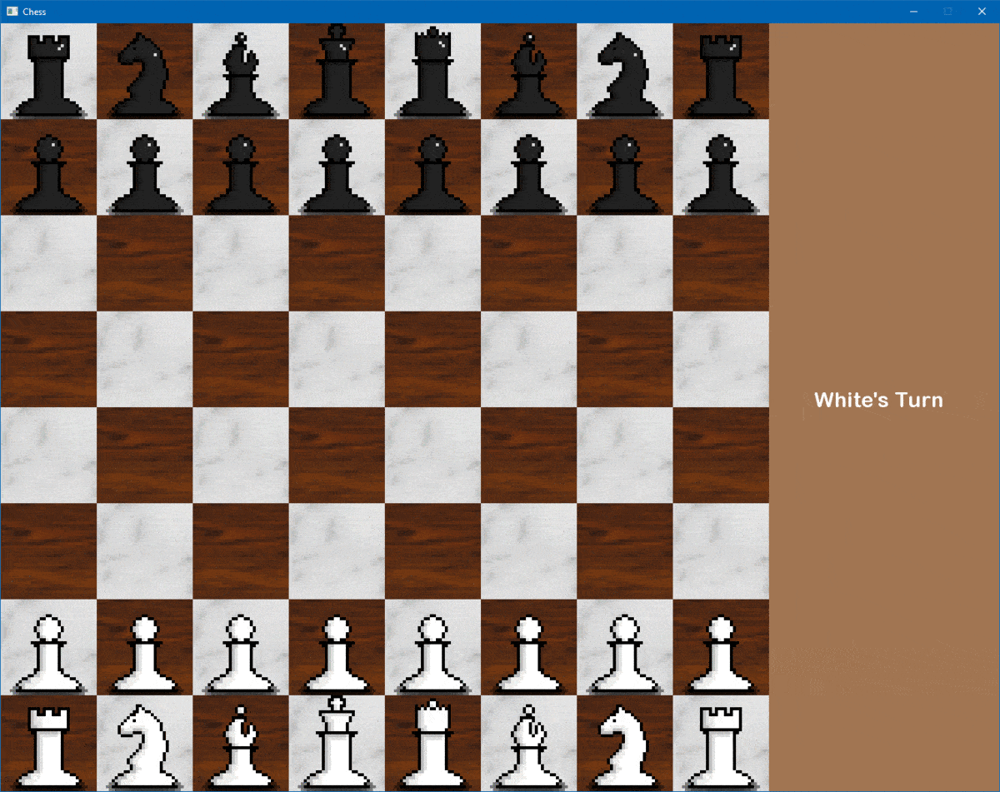

# ChessSFML
<h3>Work in Progress</h3>

A game of chess written in C# using the SFML.Net API.

All textures were created by me however the sounds are borrowed from Mojang Studios.

The game is now in a playable state but I still need to clean up the code a bit and optimize. Currently it is a two-player only game but my plans are to eventually add an AI opponent so that it can be played with just one player.

  

  

